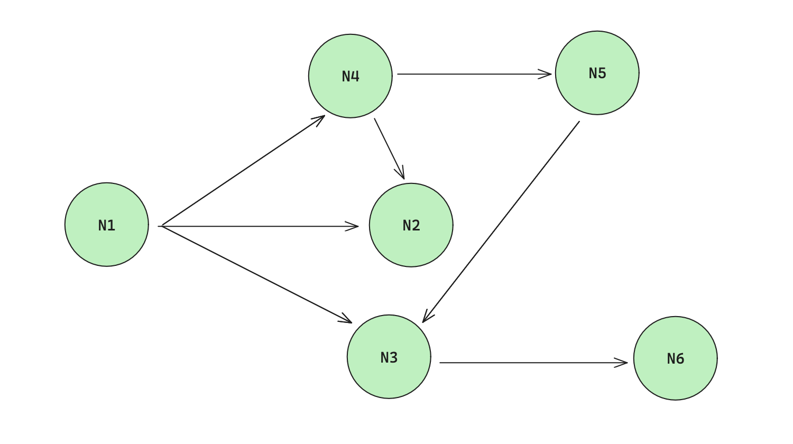

  <h1>Project Octopus</h1>
  <h3>TentacleWeb</h3>
  <image style="display: block; margin-left: auto; margin-right: auto; width: 10%; border-radius: 10%;" src="images/octopus.png"/>
  <h5>Team Indigo Sword</h5>
  <h6>2024</h6>

#### What is TentacleWeb?

- TentacleWeb is the server-side code for Project Octopus. It is implemented in Python, using the Flask - SQLAlchemy framework. It is made basically of API, class codes and unit tests.
- The 3 basic pillars of TentacleWeb are the **Node**, **Path** and **User** classes, which are used sava data in a database.
- **Node:** A class that represents a **level** in the game. It contains the level's data, such as its name, description, and its function to get its level.
- **Path:** A sequence of **Nodes** which comprise a possible **gameplay path** for the game.
- **User:** A class that represents a user in the game. It contains the user's data, such as its name, email, and password.
- You can perform a series of actions on them, which will be interfaced through the **client**.

#### What does that look like?

- We can see different **Paths**: N1 - N2, N1 - N4 - N2, etc.
- Each **Path** is made of different **Nodes**.

#### Interacting with the classes

- The only way to interact with the classes is through the **API**. It is made of **endpoints** that can be accessed through **HTTP** requests.
- Here we will document each endpoint of the API with its methods and parameters. Have in mind that when we write the name of a parameter in [brackets], it means that it is optional.
- **User related endpoints**:

  | Endpoint         | Method | Parameters                       | Description                                | Needs Login? |
  | ---------------- | ------ | -------------------------------- | ------------------------------------------ | ------------ |
  | /login           | POST   | username, password               | Log into the API.                          | no           |
  | /logout          | POST   | username                         | Log out of the API.                        | yes          |
  | /create_user     | POST   | username, email, password, [bio] | Create a new user.                         | no           |
  | /get_user        | GET    | username                         | Get user's data.                           | no           |
  | /change_user_bio | POST   | username, bio                    | Change user's bio.                         | yes          |
  | /follow_user     | POST   | username, followed_username      | Follow a user.                             | yes          |
  | /unfollow_user   | POST   | username, unfollowed_username    | Unfollow a user.                           | yes          |
  | /get_follows     | GET    | username                         | Get user's followers and who user follows. | no           |
  | /add_friend      | POST   | username, friend_username        | Add a friend.                              | yes          |
  | /accept_friend   | POST   | username, friend_username        | Accept a friend request.                   | yes          |
  | /reject_friend   | POST   | username, friend_username        | Reject a friend request.                   | yes          |
  | /remove_friend   | POST   | username, friend_username        | Remove a friend.                           | yes          |
  | /get_friends     | GET    | username                         | Get user's friends.                        | no           |

- **Node related endpoints**:

  | Endpoint                 | Method | Parameters                                                     | Description          | Needs Login? |
  | ------------------------ | ------ | -------------------------------------------------------------- | -------------------- | ------------ |
  | /create_node\*           | POST   | username, description, title, file*, [is_initial], [is_final] | Create a new node.   | yes          |
  | /get_level               | GET    | node_id                                                        | Get node's level.    | no           |
  | /update_node_level\*     | POST   | username, node_id, file\*                                      | Update node's level. | yes          |
  | /get_node                | GET    | node_id                                                        | Get node's data.     | no           |
  | /link_nodes              | POST   | username, origin_id, destination_id                            | Link two nodes.      | yes          |
  | /get_next_links          | GET    | node_id                                                        | Get next nodes.      | no           |
  | /get_previous_links      | GET    | node_id                                                        | Get previous nodes.  | no           |
  | /update_playcount        | POST   | node_id                                                        | Update playcount.    | no           |
  | /update_rating           | POST   | username, node_id, rating                                      | Update rating.       | yes          |
  | /update_node_description | POST   | username, node_id, description                                 | Update description.  | yes          |
  | /update_node_title       | POST   | username, node_id, title                                       | Update title.        | yes          |

  *: This endpoint needs to have also a file uploaded with the node's level. The name of the file does not matter. It should be in the request's *files* attribute under the key *file\*.

- **Path related endpoints**:

  | Endpoint                 | Method | Parameters                                            | Description                   | Needs Login? |
  | ------------------------ | ------ | ----------------------------------------------------- | ----------------------------- | ------------ |
  | /create_path             | POST   | username, description, title,                         | Create a new node.            | yes          |
  | /add_to_path             | POST   | username, path_id, node_id, position                  | Add node to path.             | yes          |
  | /get_path                | GET    | path_id                                               | Get path's data.              | no           |
  | /create_path_from_nodes  | POST   | username, title, description, node_ids\*, positions\* | Create a new path from nodes. | yes          |
  | /update_path_playcount   | POST   | path_id                                               | Update playcount.             | no           |
  | /update_path_rating      | POST   | username, path_id, rating                             | Update rating.                | yes          |
  | /update_path_description | POST   | username, path_id, description                        | Update description.           | yes          |
  | /update_path_title       | POST   | username, path_id, title                              | Update title.                 | yes          |
  | /get_user_paths          | GET    | username                                              | Get user's paths.             | no           |
  | /get_node_paths          | GET    | node_id                                               | Get node's paths.             | no           |

\*: This variable needs to be a list. It should be in the request's _form_ attribute under the key *node_ids\* or *positions\*.

- If you want to interact with the API using some other language and don't want to learn flask in depth (like we had to do over here to interface it), check our Client's documentation on [our game's repo](https://github.com/indigo-sword/godot-3.5) 